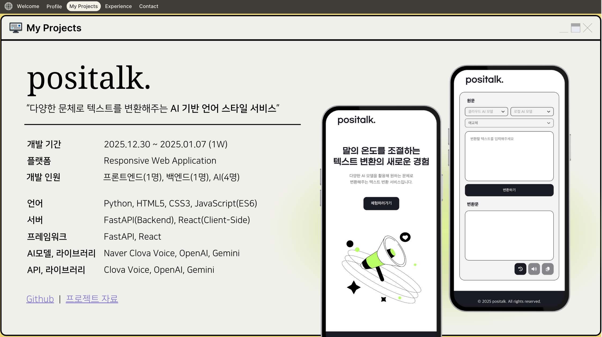

# positalk.
  
<br/>

## 📋 개요
positalk는 다양한 AI 언어 모델을 활용하여 텍스트 스타일 변환과 음성 합성(TTS) 기능을 제공하는 서비스입니다. 사용자의 메시지를 다양한 스타일로 변환하고, 텍스트를 음성으로 변환할 수 있습니다.  
<br/>

## 🗂️ 목차
- [기능](#기능)
- [기술 스택](#기술-스택)
- [설치 방법](#설치-방법)
- [사용 방법](#사용-방법)
- [프로젝트 구조](#프로젝트-구조)
- [API 엔드포인트](#api-엔드포인트)
- [지원 모델](#지원-모델)
- [메모리 관리](#메모리-관리)
- [라이센스](#라이센스)
<br/>

## 기능
- **텍스트 스타일 변환**: 다양한 AI 모델을 사용하여 입력 텍스트의 스타일을 변환
- **음성 합성(TTS)**: 텍스트를 음성으로 변환하는 기능 제공
- **다중 모델 지원**: OpenAI, Gemini, Polyglot-Ko, KoGPT2, Qwen 시리즈 등 다양한 AI 모델 지원
- **메모리 최적화**: 필요한 모델만 메모리에 로드하여 리소스 효율성 제공
<br/>

## 기술 스택
- **백엔드**: FastAPI
- **AI 모델**:
  - OpenAI GPT 모델
  - Google Gemini
  - Polyglot-Ko
  - KoGPT2
  - Qwen 시리즈 (1.5-1.8B, 2.5-1.5B, 2.5-7B, 2.5-3B)
  - Bllossom
  - 커스텀 모델 (heegyu, 9unu)
- **TTS**: 음성 합성 API
- **환경 관리**: dotenv
<br/>

## 설치 방법
프로젝트를 로컬 환경에서 실행하기 위한 단계별 가이드를 제공합니다.
<br/>

### 요구사항
- Python 3.8 이상
- pip (Python 패키지 관리자)
- 각 AI 모델에 필요한 API 키 또는 모델 파일
<br/>

### 설치 단계
```bash
# 저장소 클론
git clone https://github.com/your-username/positalk.git

# 디렉토리 이동
cd positalk

# 가상 환경 생성 (선택사항)
python -m venv venv
source venv/bin/activate  # Linux/Mac
# 또는
venv\Scripts\activate  # Windows

# 의존성 설치
pip install -r requirements.txt

# 환경 변수 설정
# .env 파일을 생성하고 필요한 API 키 등을 설정

# 서버 실행
uvicorn main:app --reload
```
<br/>

## 사용 방법
API를 사용하여 텍스트 스타일 변환 및 TTS 기능을 활용하는 방법입니다.
<br/>

### 텍스트 스타일 변환
```python
import requests
import json

url = "http://localhost:8000/api/chat"
payload = {
    "message": "안녕하세요, 반갑습니다.",
    "style": "formal",
    "model": "openai-gpt",
    "subModel": "gpt-4o-mini"
}
headers = {"Content-Type": "application/json"}

response = requests.post(url, data=json.dumps(payload), headers=headers)
print(response.json())
```
<br/>

### TTS 사용
```python
import requests

url = "http://localhost:8000/api/tts"
payload = {
    "text": "안녕하세요, 반갑습니다.",
    "voice": {
        "voice_id": "default"
    }
}
headers = {"Content-Type": "application/json"}

response = requests.post(url, json=payload, headers=headers)
with open("output.mp3", "wb") as f:
    f.write(response.content)
```
<br/>

## 프로젝트 구조
```
positalk/
├── positalk_fastapi/
│   ├── main.py                      # FastAPI 메인 애플리케이션
│   ├── openai_api.py                # OpenAI API 핸들러
│   ├── gemini_api.py                # Gemini API 핸들러
│   ├── polyglot_ko_api.py           # Polyglot-Ko 핸들러
│   ├── kogpt2_handler.py            # KoGPT2 핸들러
│   ├── qwen_1_5_1_8b.py             # Qwen 1.5 1.8B 핸들러
│   ├── qwen_2_5_1_5b_instruct.py    # Qwen 2.5 1.5B 핸들러
│   ├── qwen_2_5_7b_instruct.py      # Qwen 2.5 7B 핸들러
│   ├── bllossom_handler.py          # Bllossom 핸들러
│   ├── text_style_converter_qwen25_3b_instruct.py  # Qwen 3B 스타일 변환기
│   ├── heegyu.py                    # 커스텀 스타일 변환기
│   ├── formal_9unu.py               # 공식적 스타일 변환기
│   ├── gentle_9unu.py               # 부드러운 스타일 변환기
│   ├── tts_handler.py               # TTS 핸들러
│   └── .env                         # 환경 변수 파일
├── positalk_react/                  # 프론트엔드 애플리케이션
└── .gitignore                       # Git 무시 파일 목록
```
<br/>

## API 엔드포인트
### 채팅 API
```
POST /api/chat
```
<br/>

**요청 본문**:
```json
{
  "message": "변환할 텍스트",
  "style": "원하는 스타일",
  "model": "사용할 모델",
  "subModel": "서브 모델(선택사항)"
}
```
<br/>

**응답**:
```json
{
  "response": "변환된 텍스트"
}
```
<br/>

### TTS API
```
POST /api/tts
```
<br/>

**요청 본문**:
```json
{
  "text": "음성으로 변환할 텍스트",
  "voice": {
    "voice_id": "음성 ID",
    "other_parameters": "기타 매개변수"
  }
}
```
<br/>

**응답**: 오디오 파일 (audio/mp3)  
<br/>


## 지원 모델
- **openai-gpt**: OpenAI의 GPT 모델 (GPT-4o-mini 등)
- **gemini**: Google의 Gemini 모델
- **polyglot-ko**: 한국어 특화 Polyglot 모델
- **kogpt2**: 한국어 GPT-2 모델
- **qwen18b**: Qwen 1.5 1.8B 모델
- **qwen15b**: Qwen 2.5 1.5B 모델
- **qwen7b**: Qwen 2.5 7B 모델
- **qwen3b**: Qwen 2.5 3B 모델 (스타일 변환 특화)
- **bllossom**: Bllossom 모델
- **heegyu**: 커스텀 스타일 변환 모델
- **h9**: 공식적/부드러운 스타일 변환 모델
<br/>

## 메모리 관리
이 애플리케이션은 효율적인 메모리 사용을 위해 필요할 때만 모델을 로드하고, 다른 모델이 요청되면 이전 모델을 메모리에서 해제하는 방식으로 동작합니다. 이를 통해 제한된 리소스에서도 다양한 AI 모델을 사용할 수 있습니다.  
<br/>


## 라이센스
이 프로젝트는 MIT 라이센스를 따릅니다. 자세한 내용은 LICENSE 파일을 참조하세요.  
<br/>


## 추가 자료
FastAPI 문서 : https://fastapi.tiangolo.com/

Hugging Face Transformers 문서 : https://huggingface.co/docs/transformers/index

PyTorch 설치 가이드 : https://pytorch.org/get-started/locally/
